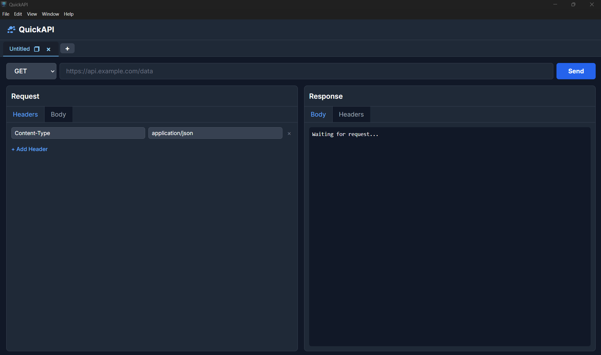

# QuickAPI 🚀

A lightweight, multi-tab desktop API testing tool built with **Electron**, **HTML**, and **Tailwind CSS**.  
A simple alternative to Postman for quick request testing.



---

## ✨ Features

- **Multi-Tab Interface:** Manage multiple requests in separate, renameable tabs.  
- **Duplicate Tabs:** Instantly duplicate an existing request (method, URL, headers, and body) into a new tab.  
- **Full API Support:** Supports all major HTTP methods:
  - GET, POST, PUT, PATCH, DELETE, OPTIONS, HEAD  
- **Custom Requests:**
  - Set custom HTTP Headers  
  - Write and send custom request bodies (e.g., for POST requests)  
- **Detailed Responses:**
  - View response **Status Code** (e.g., `200 OK`), **Time**, and **Size**  
  - Inspect the **Response Body** (with JSON formatting)  
  - Inspect the **Response Headers**

---

## 🧩 Tech Stack

- **Electron** – For building the cross-platform desktop app  
- **Tailwind CSS** – For the modern, utility-first UI  
- **Vanilla JavaScript (ES6+)** – For all the application logic  
- **electron-builder** – For compiling and packaging the app into an `.exe` (and other formats)

---

## ⚙️ Getting Started

Follow these instructions to get a copy of the project up and running on your local machine for development and testing purposes.

### 🧱 Prerequisites

Make sure you have the following installed:

- [Node.js](https://nodejs.org/) (v18 or later recommended)  
- [Git](https://git-scm.com/)

---

### 1. Installation & Development

First, clone the repository and install all the required npm packages.

```bash
# Clone the repository
git clone https://github.com/YOUR_USERNAME/quickapi-desktop.git

# Navigate into the project directory
cd quickapi-desktop

# Install dependencies
npm install
````

To run the app in development mode (with live reload and dev tools):

```bash
# Run the app
npm start
```

---

### 2. Building for Production

To build the final, packaged `.exe` file for distribution:

```bash
# Build the application
npm run build
```

---

### ❗ Important Windows Build Note

When building on Windows, **electron-builder** needs to download helper tools and create *symbolic links*.
This requires **administrative privileges**.

If your build fails with an error like:

```
ERROR: Cannot create symbolic link : A required privilege is not held by the client.
```

You have two solutions:

#### 🔹 Quick Fix

Close your terminal and **run it as Administrator** before trying `npm run build` again.

#### 🔹 Permanent Fix

Enable **Developer Mode** in your Windows Settings:

1. Go to `Settings > Update & Security > For developers`
2. Toggle **Developer Mode** to **On**
3. Restart your terminal

---

### 3. 📦 Find Your App

Once the build is complete, you will find your packaged application
(e.g., `QuickAPI Setup 1.0.0.exe`) inside the newly created **`dist`** folder.

---

> 💡 *QuickAPI is designed for developers who want a fast, distraction-free tool for API testing — without the bulk of traditional clients like Postman.*

